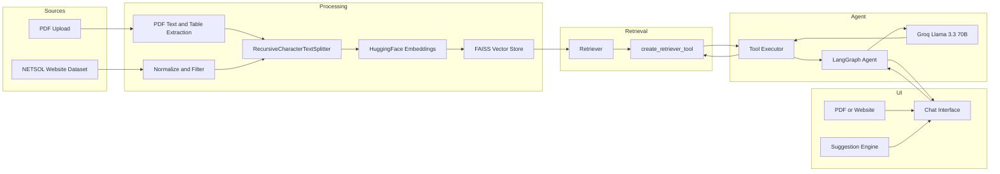
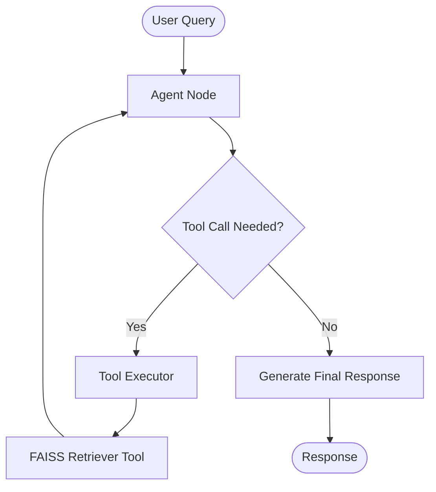

# Universal RAG Assistant

A production ready Retrieval Augmented Generation (RAG) chatbot built using LangGraph, LangChain, FAISS, HuggingFace Embeddings, Groq Llama 3.3 70B, and Gradio.

The system supports two independent knowledge sources:

1. PDF documents uploaded by the user.
2. NETSOL Technologies website content.

Users can seamlessly switch between both sources through a unified chat interface.

---

## Features

### PDF Question Answering

- Upload any PDF document
- Extract text and tables
- Automatic chunking and indexing
- FAISS vector search
- Dynamic question suggestions
- Context aware retrieval

### Website Question Answering

- Pre indexed NETSOL website dataset
- Automatic startup indexing
- Semantic search
- Source specific suggestions

### LangGraph Agent

- Tool calling workflow
- Retrieval first architecture
- Multi turn conversations
- Chat history support
- Context grounded responses

### Interactive UI

- PDF upload panel
- Website status panel
- Source selector
- Chat interface
- Dynamic suggestion buttons

---

## Architecture Overview

```text
PDF Upload
    │
    ▼
Extract Text + Tables
    │
    ▼
Chunking
    │
    ▼
Embeddings
    │
    ▼
FAISS
    │
    ▼
Retriever Tool
    │
    ▼
LangGraph Agent
    │
    ▼
Groq LLM
    │
    ▼
Answer
```

The website pipeline follows the same retrieval architecture.

---

## System Architecture



---

## Detailed Workflow

### Website Pipeline

1. Download NETSOL website dataset from GitHub.
2. Normalize and clean scraped content.
3. Filter low quality pages.
4. Split content into chunks.
5. Generate embeddings.
6. Store vectors in FAISS.
7. Create retriever.
8. Wrap retriever as a LangChain tool.
9. Connect tool to LangGraph agent.

### PDF Pipeline

1. Upload PDF.
2. Extract text and tables using pdfplumber.
3. Create document objects.
4. Split into chunks.
5. Generate embeddings.
6. Store vectors in FAISS.
7. Create retriever.
8. Build PDF specific LangGraph agent.

### Question Answering Pipeline

1. User selects source.
2. User asks a question.
3. Chat history is converted into LangChain messages.
4. LangGraph agent receives query.
5. Agent calls retrieval tool.
6. Retriever returns Top K chunks.
7. Tool executor formats context.
8. LLM generates grounded answer.
9. Response appears in chat interface.

---

## LangGraph Agent Flow



---

## Project Structure

```text
project/
│
├── app.py
├── requirements.txt
├── README.md
│
├── PDF Pipeline
│   ├── PDF Extraction
│   ├── Table Extraction
│   ├── Chunking
│   └── Vectorization
│
├── Website Pipeline
│   ├── JSON Loader
│   ├── Normalization
│   ├── Filtering
│   └── Vectorization
│
├── LangGraph Agent
│   ├── Agent Node
│   ├── Tool Executor
│   ├── Conditional Routing
│   └── Tool Calling
│
└── Gradio UI
    ├── Chat Interface
    ├── Upload Panel
    ├── Source Selector
    └── Suggestion Engine
```

---

## Technology Stack

| Component | Technology |
|------------|------------|
| Frontend | Gradio |
| Agent Framework | LangGraph |
| LLM Framework | LangChain |
| LLM | Groq Llama 3.3 70B Versatile |
| Embeddings | all-MiniLM-L6-v2 |
| Vector Database | FAISS |
| PDF Parsing | pdfplumber, pypdf |
| Retrieval | Similarity Search |
| Chunking | RecursiveCharacterTextSplitter |

---

## Configuration

```python
CHUNK_SIZE = 800
CHUNK_OVERLAP = 150
TOP_K = 6
MIN_CHARS = 300

EMBED_MODEL = "sentence-transformers/all-MiniLM-L6-v2"

LLM_MODEL = "llama-3.3-70b-versatile"

MAX_TOKENS = 1024
TEMPERATURE = 0.2
```

---

## Dynamic Question Suggestions

### Website Mode

- What is NetSol Technologies and what does it do?
- What products and solutions does NetSol offer?
- Who are NetSol's key clients and partners?
- What is the Transcend Platform?
- What were NetSol's financial results?
- What certifications does NetSol hold?

### PDF Mode

Questions are generated dynamically from:

- Headings
- Organizations
- Financial figures
- URLs
- Document structure
- Key entities

---

## Installation

```bash
git clone <repository-url>

cd universal-rag-assistant

pip install -r requirements.txt
```

---

## Environment Variables

Create a `.env` file:

```env
GROQ_API_KEY=your_groq_api_key
```

---

## Run Application

```bash
python app.py
```

---

## Future Enhancements

- Multi source retrieval
- Hybrid BM25 plus Vector Search
- Citation generation
- Streaming responses
- Persistent vector storage
- Multi PDF support
- Source attribution
- Conversation memory
- Reranking layer
- Evaluation dashboard

---

## Key Highlights

- Dual source RAG system
- LangGraph agent architecture
- Tool calling retrieval workflow
- Dynamic PDF understanding
- Website knowledge base support
- FAISS semantic search
- Groq powered inference
- Interactive Gradio interface